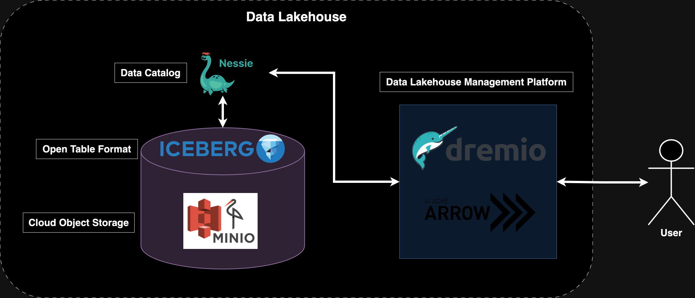

# IcebergLakehouse
Building a Data Lakehouse with Apache Iceberg, Spark, Dremio, Nessie & Minio

Gain the same pros of Data Warehouse and much more with your own storage layer and query engine:

(1) ACID compliant
(2) Schema and partition evolution
(3) Data versioning
(4) Cross-platform tech agnostic
(5) Incremental processing

Main tech stack components

Apache Iceberg - open table format.
Minio - cloud object storage (equivalent to S3).
Nessie - data catalog.
Dremio - data lakehouse management platform.
Spark - proof of ability to create an iceberg db table with an external engine.

